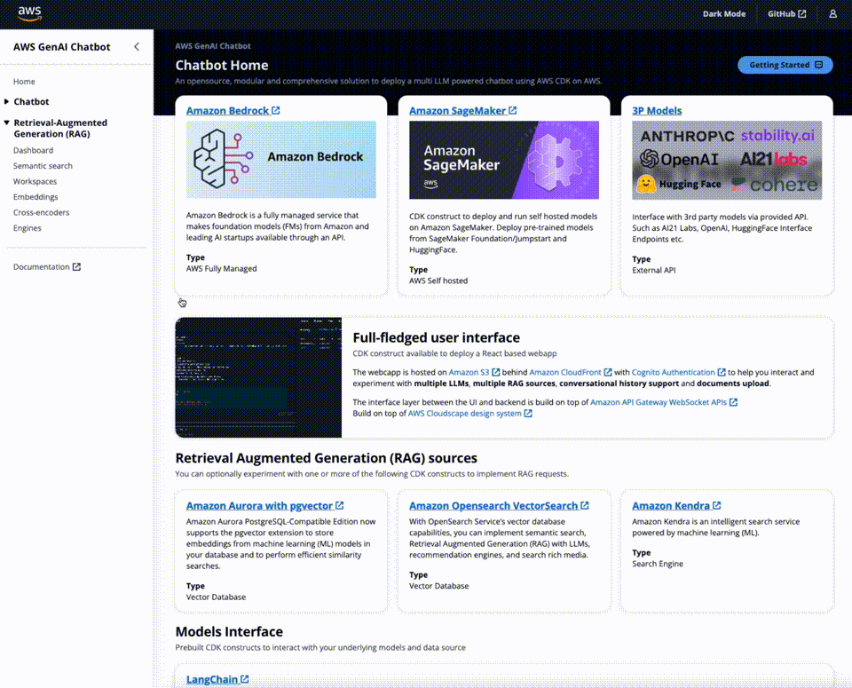

# [WIP] Deploying a Multi-LLM and Multi-RAG Powered Chatbot Using AWS CDK on AWS
[](https://github.com/aws-samples/aws-genai-llm-chatbot/releases)
[](https://star-history.com/#aws-samples/aws-genai-llm-chatbot)
[](https://opensource.org/licenses/MIT)


## Table of content
- [Features](#features)
- [Precautions](#precautions)
- [Preview Access and Service Quotas](#preview-access-and-service-quotas)
- [Deploy](#deploy)

# Features
## Modular, comprehensive and ready to use
This solution provides ready-to-use code so you can start **experimenting with a variety of Large Language Models, settings and prompts.** in your own AWS account.

Supported models providers:
- [Amazon Bedrock](https://aws.amazon.com/bedrock/) 
- [Amazon SageMaker](https://aws.amazon.com/sagemaker/) self hosted models from Foundation, Jumpstart and HuggingFace.
- Third party providers via API such as Anthropic, Cohere, AI21 Labs, OpenAI, etc. [See available langchain integrations](https://python.langchain.com/docs/integrations/llms/) for a comprehensive list.


## Experiment multiple RAG options with Workspaces


## Unlock RAG potentials with Workspaces Debugging Tools


## Full-fledged User Interface
The repository includes a CDK construct to deploy  a **full-fledged UI** built with [React](https://react.dev/) to interact with the deployed LLMs as chatbots. Hosted on [Amazon S3](https://aws.amazon.com/s3/) and distributed with [Amazon CloudFront](https://aws.amazon.com/cloudfront/). Protected with [Amazon Cognito Authentication](https://aws.amazon.com/cognito/) to help you interact and experiment with multiple LLMs, multiple RAG sources, conversational history support and documents upload.
The interface layer between the UI and backend is built with [Amazon API Gateway WebSocket APIs](https://docs.aws.amazon.com/apigateway/latest/developerguide/apigateway-websocket-api.html).


Build on top of [AWS Cloudscape Design System](https://cloudscape.design/).


# Precautions

Before you begin using the solution, there are certain precautions you must take into account:

- **Cost Management with self hosted models on SageMaker**: Be mindful of the costs associated with AWS resources, especially with SageMaker models which are billed by the hour. While the sample is designed to be cost-effective, leaving serverful resources running for extended periods or deploying numerous LLMs can quickly lead to increased costs.

- **Licensing obligations**: If you choose to use any datasets or models alongside the provided samples, ensure you check LLM code and comply with all licensing obligations attached to them.

- **This is a sample**: the code provided as part of this repository shouldn't be used for production workloads without further reviews and adaptation.

# Preview Access and Service Quotas
- **Amazon Bedrock**
If you are looking to interact with models from Amazon Bedrock FMs, you need to request preview access from the AWS console.
Futhermore, make sure which regions are currently supported for Amazon Bedrock.


- **Instance type quota increase**
You might consider requesting an increase in service quota for specific SageMaker instance types such as the `ml.g5` instance type. This will give access to latest generation of GPU/Multi-GPU instances types. You can do this from the AWS console.

- **Foundation Models Preview Access**
If you are looking to deploy models from SageMaker foundation models, you need to request preview access from the AWS console.
Futhermore, make sure which regions are currently supported for SageMaker foundation models.


# Deploy

We are providing a tool that guides you in the configuration of the solution.

* Pre-requisites: you need to setup [authentication with AWS](https://docs.aws.amazon.com/cdk/v2/guide/getting_started.html#getting_started_auth)

Run the following instructions to clone the repository and build the project.

```bash
git clone https://github.com/aws-samples/aws-genai-llm-chatbot
cd aws-genai-llm-chatbot
npm install
npm run build
```

Once done, run:

```bash
npm run create
```

You'll be prompted to configure the different aspects of the solution: the LLMs to enable (we support all models provided by Bedrock, FalconLite and LLama 2, more to come) and the setup of the RAG system (we support Aurora, more to come).

When at done, answer `Y` to create a new configuration file and run:

```bash
npx cdk deploy
```

If this is the first time you run `npx cdk deploy` in the configured account and region, you'll need to bootstrap `cdk` following the instructions on screen. Once done, rerun the previous command.

## Migration from v2

We do not support migrating a V2 chatbot to V3, but you can have both solution running.